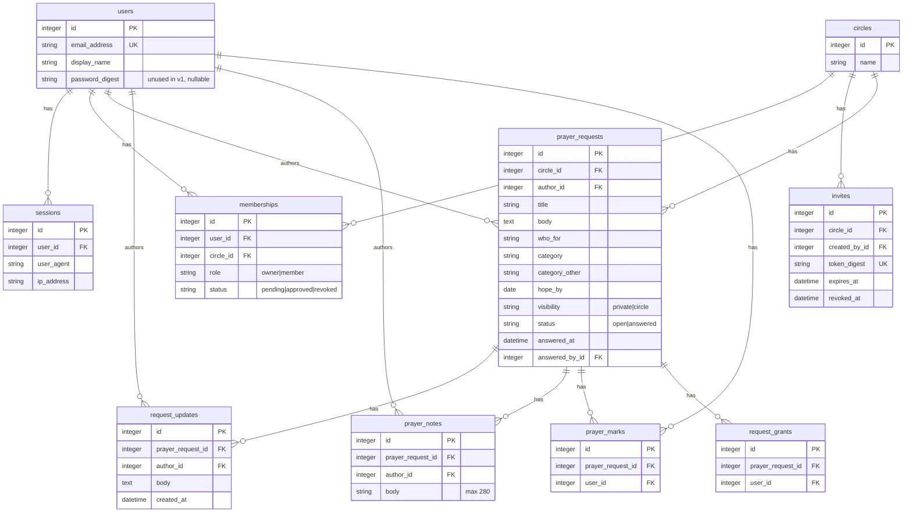

# feat: Prayer journal v1 (small circle)

## Overview

Build a desktop-web prayer journal for **one small circle** (family, prayer partner, or small group). People log prayer requests; approved members who can see a request may mark **I prayed** and leave a **short note**. The author adds **dated updates**. Anyone who can see a request may mark it **answered**, which moves it to an answered list (title, body, updates, and notes kept). Join is **invite link + owner approve**. Two emails: new circle-visible request, and “yours was marked answered.”

This is Approach **C** from the brainstorm: the real group loop, thin first slice. Named-people ACL, daily digest, PWA, native, and multi-circle UI are later — the data model must not block them.

(see brainstorm: [docs/brainstorms/2026-08-22-prayer-journal-brainstorm.md](../brainstorms/2026-08-22-prayer-journal-brainstorm.md))

## Problem Statement

Paper lists and group chats lose the thread: what we asked, who covered it, and what was answered. v1 exists so a trusted circle actually logs requests, taps I prayed, and marks answers **without nagging**.

## Proposed Solution

A Rails 8.1 Hotwire app, one deploy, closed membership, scoped queries for every read/write. First confirmed user bootstraps the single circle as owner. Everyone else joins through a rotatable invite token and sits **pending** until the owner approves.

## Technical Approach

### Architecture

**Stack (v1, rewritten):** Next.js 16 App Router, React 19, TypeScript, Tailwind CSS 4, Drizzle ORM, SQLite via libSQL, Better Auth 1.7 magic links, Resend (or `tmp/mails` in dev). Rails 8 was prototyped first and replaced.

**Original Rails lock (superseded):**

| Piece | Choice | Why |
|---|---|---|
| App | Rails **8.1** + Hotwire (Turbo/Stimulus) | CRUD + membership + mail is Rails’ home turf. One framework, not four. |
| DB | **SQLite** (Rails 8 default) + Solid Queue on its own SQLite file | Family-scale. Switch `-d postgresql` later if hosting requires it. |
| Auth | `bin/rails generate authentication` as session scaffold + **passwordless magic link** | Email is already the notification channel. No password product. No Google. No Clerk. No Auth.js. |
| Jobs | Solid Queue + `deliver_later` | Durable mail; do not send inline in the request. |
| Mail | Action Mailer → **Resend SMTP** | Instant production, DKIM. Not Gmail/M365 SMTP. |
| UI | Server-rendered journal, not a React/shadcn dashboard | Desktop-first, still usable on a phone browser for invite + list. |
| Tests | Minitest + Rails integration tests | Default. Request-level tests for IDOR and invite gates. |
| Deploy | Kamal on a small VPS, or Fly/Render | `force_ssl`. Volume encryption from the host. |

**Do not use:** Auth.js/next-auth (maintenance-only; new apps → Better Auth, which we are not taking), Clerk (wrong trust boundary for prayer text), Devise, Pundit, Redis, Sidekiq, SES, Gmail SMTP.

**Auth shape:**

- `User` + `Session` (signed cookie + server row).
- `generates_token_for :signin, expires_in: 30.minutes`.
- Request-link form always returns the same copy (“Check your email”) — no email/membership enumeration.
- **GET does not consume the token** (Outlook/Gmail scanners). Show a confirm page; **POST** consumes and starts the session.
- Rate-limit send and confirm (`rate_limit to: 5, within: 3.minutes`).
- Session ~30 days, sliding. HttpOnly / Secure / SameSite=Lax.
- No open registration. Users appear via bootstrap or invite.

**Authorization rule (one helper, used in queries not only views):**

```
visible if membership.approved? AND (
  request.author_id == user.id
  OR request.visibility == "circle"
  OR EXISTS request_grants(request, user)   -- table exists, always empty in v1
)
```

Never `PrayerRequest.find(params[:id])`. Always `Current.user.accessible_requests.find(...)`. Unauthenticated or non-member hitting a request URL → **404**, not 403 (no existence oracle).

### Domain model

Keep **circles** even though v1 UI is one circle. Keep `visibility` as an enum (next value: `named`). Keep `request_grants` empty.



**Indexes / constraints:**

- `memberships` unique `(circle_id, user_id)`
- `prayer_marks` unique `(prayer_request_id, user_id)`
- `invites.token_digest` unique
- `users.email_address` unique, `normalizes` strip+downcase
- `request_grants` unique `(prayer_request_id, user_id)` (unused in UI)

**Object split (do not collapse in v1):**

| Object | Who writes | Purpose |
|---|---|---|
| Request body | Author | Original ask |
| Request update | **Author only** | Dated progress; append-only; author may delete own row |
| Prayer note | Anyone who can **see** | Short “praying for you”; author of the note may edit/delete own |
| Prayer mark | Anyone who can **see** | One row per user+request; un-tap **destroys** |

### Implementation Phases

#### Phase 1: Foundation (auth + bootstrap)

- `git init` (repo currently has no `.git`).
- `rails new . --skip-jbuilder` (SQLite). Enable cssbundling or propshaft + Tailwind only if it stays thin; default importmaps + modest CSS is enough.
- `bin/rails generate authentication`. Drop or ignore password UI. Add magic-link mailer + confirm POST.
- First confirmed user on empty `circles` → create circle (`name` default “Our circle”), membership `role: owner, status: approved`.
- Second user on empty membership and no invite → “Ask the owner for an invite.” No second circle.
- Success: you can request a link, confirm, and land in an empty journal as owner.

#### Phase 2: Membership (invite + approve)

- One **reusable, rotatable** invite token per circle. Store **digest** only (`SecureRandom.urlsafe_base64(32)`). Expiry 30 days or until revoked. Owner “Reset invite link.”
- `/join/:token` → must be signed in → `memberships` `pending` (idempotent). Expired/revoked token → dead page, no membership.
- Owner: pending list, Approve / Decline. Approve → `approved`. Decline → stay signed in, “not in this circle.”
- Owner may revoke an approved member (not self). Content **kept**; they lose reads of others’ items.
- Revoked user hitting the same invite → `pending` again.
- Pending sees **nothing** of the journal (waiting screen). No join-request email in v1 (owner badge is enough).
- Success: a second person can join only after owner approval.

#### Phase 3: Core requests

- CRUD-ish: create, show, open list, answered list.
- Fields: title (required, 120), body (optional, 2000), who-for (optional free text, 80), category (`health`, `family`, `work_school`, `church_ministry`, `friends`, `other` + optional `category_other`), hope-by (optional date), visibility `private|circle` (default `circle`).
- Open list: `status=open`, visible-to-me, sort hope-by **asc, nulls last**.
- Answered list: `status=answered`, visible-to-me, sort `answered_at desc`.
- Private requests: author only; **never emailed**.
- Success: owner posts a circle request and a private one; a member sees only the circle one.

#### Phase 4: Marks, notes, author updates

- `POST/DELETE` prayer mark; unique index is the lock. Allowed on **open** visible requests, including own. Show **count + display names**.
- Notes: 280 chars, on **open** visible requests. Own note edit/delete only. Nobody else deletes your note in v1 (including owner).
- Updates: author only, append-only, 2000 chars, author may delete own row.
- Answered requests: **read-only** except reopen. History remains.
- Success: member taps I prayed, untaps, leaves a note; author posts an update.

#### Phase 5: Answered + mail

- Any approved viewer may mark answered → `status: answered`, `answered_at`, `answered_by_id`. Moves lists.
- Reopen: same people who can see it (author or any approved viewer of a circle request). Null answered fields; **keep** old prayer marks. No reopen email.
- Mail 1: new **circle** request → other **approved** members, not author, not pending. **Title + link only** — never the body.
- Mail 2: marked answered → **author only**, skipped if they marked it themselves.
- `deliver_later` + `enqueue_after_transaction_commit`. Resend idempotency keys: `new-request/{id}`, `answered/{id}`.
- Visibility private→circle on edit = first publish → send new-request email once. Circle→private = hide, no email.
- Success: member answers someone else’s request; author gets mail; private create is silent.

#### Phase 6: Polish + hardening

- Author edit: title, body, who-for, category, hope-by, visibility. Author **delete** request (cascades updates/notes/marks).
- Display name: prompt on first landing, skip-once, placeholder from email local-part. Names (not emails) in the UI.
- Empty states: no open, no answered, waiting for approval, need invite.
- Rotate invite, circle name field, privacy one-pager (what we store, how to delete).
- Tests listed under Quality Gates. Rate limits, `force_ssl` in prod, `filter_parameters` for tokens, CSP `:self`.
- Phone-usable layout for auth, waiting, list, detail (desktop is primary).
- Success: IDOR tests pass; deploy; real circle uses it.

### Resolved open questions

From the brainstorm, decided in planning:

| Question | v1 decision | Rationale |
|---|---|---|
| Auth | Magic link, confirm POST | Simplest; matches mail channel. Scanners must not consume GET. |
| Categories | Fixed list + Other | Filters later; free text becomes junk. |
| Who-for | Free text | People you pray for are often not members. |
| Reopen answered? | Yes, anyone who can see the request | Same trust as “anyone may mark answered.” |
| Edit/delete request | Author edit + delete. Notes/updates: **own** only | Owner moderation later. |
| Un-tap I prayed? | Yes, destroy the row | Accidents happen. Unique index. |
| UI language | English, i18n keys from day one | One copy. Swap locale later, don’t fork. |

Other planning locks: reusable invite token; no join emails; no prayer body in email; answered is read-only until reopen; 404 for unauthorized request URLs.

## Alternative Approaches Considered

- **A — shared list only:** rejected in brainstorm; no group ritual.
- **B — full spec (named ACL + digest + PWA/native hooks):** rejected; stall risk.
- **Next.js 16 + Better Auth + Drizzle + Inngest + Resend:** viable, more glue, Server Action auth footguns, Auth.js is a trap. Only if the implementer will not write Ruby.
- **Clerk / Google OAuth / Devise / passwords:** extra vendor, extra UX, or extra product. Skip.

## System-Wide Impact

### Interaction Graph

- `PrayerRequestsController#create` (circle visibility) → insert request → `CircleMailer.new_request.deliver_later` per other approved member → Solid Queue → Resend SMTP.
- `PrayerRequestsController#answer` → update status → `CircleMailer.request_answered.deliver_later` to author (if other) → queue → Resend.
- `MagicSigninsController#create` → always 200 + same copy → mailer `deliver_later` → user POST confirm → `start_new_session_for` → maybe bootstrap circle.
- `JoinsController#create` → pending membership → owner `MembershipsController#update` → approved → journal scopes include that user.
- Turbo morphs on mark/unmark; no separate JS store of prayer state.

### Error & Failure Propagation

- Invalid/expired magic token on POST → flash, offer new link. GET never errors as “already used” if unused.
- Resend 403 (unverified domain) → job retries then dead; request create still succeeds. Surface mail failures in logs, not the form.
- Unique `prayer_marks` conflict → treat as success (`create_or_find_by!`).
- Invite expired → 404-like dead page.
- Unscoped find: **forbidden by convention**; tests must catch IDOR.

### State Lifecycle Risks

- Partial create + mail: enqueue **after commit** so a rolled-back request never emails.
- Bootstrap race: two first users — first committed transaction owns the circle; second needs an invite. Use `Circle.create` guarded by `Circle.none?` inside a transaction.
- Revoke does **not** delete content (orphans are OK).
- Reopen nulls `answered_at` / `answered_by_id`; does not delete history.
- Invite rotation: old digest revoked; in-flight pending memberships stay pending.

### API Surface Parity

v1 is HTML only (Hotwire). No JSON API. When native/PWA arrives, add a JSON layer on the same models — do not pre-build it.

### Integration Test Scenarios

1. **Pending gate:** pending user cannot GET open list or a known request id (404).
2. **Private IDOR:** member cannot GET another’s private request (404) and create of private request sends **zero** mail.
3. **Magic GET:** visiting the magic URL does not create a session; POST does; second POST fails.
4. **Answer + mail:** member answers a circle request; author’s mailbox job is enqueued; answering your own is not.
5. **Un-tap:** two POSTs to pray create one row; DELETE removes it; count matches.

## Acceptance Criteria

### Functional Requirements

- [x] First confirmed user becomes owner of the single circle.
- [x] Invite link + owner approve/decline/revoke. Pending sees no journal.
- [x] Create request with title, optional body, who-for, category, hope-by, visibility private|circle.
- [x] Open list sorted by hope-by (nulls last); answered list by answered_at desc.
- [x] Dated author updates (append-only); author can delete own update.
- [x] Approved viewers: I prayed / un-tap; short notes (own edit/delete).
- [x] Author or any approved viewer of a visible request can mark answered; item moves; history kept.
- [x] Reopen returns it to the open list; old prayer marks kept.
- [x] Email on new **circle** request to other approved members (title+link).
- [x] Email to author when someone else marks theirs answered.
- [x] Private requests never emailed and never listed to others.
- [x] Author can edit request fields and change visibility (private→circle sends publish email once).
- [x] Magic link confirm-click; GET does not log you in.

### Non-Functional Requirements

- [x] Desktop-first; invite/auth/list/detail usable on a phone browser.
- [x] HTTPS in production; session cookie Secure/HttpOnly/SameSite=Lax.
- [x] No third-party analytics; no prayer body in logs or email.
- [x] English UI; i18n keys so a locale file can swap later.

### Quality Gates

- [x] Integration tests for the five scenarios above.
- [x] Unique index on prayer marks proven by test.
- [x] README: how to boot, how to send mail in dev, how to bootstrap the owner.
- [x] Privacy one-pager.

## Success Metrics

The circle **logs requests**, **marks answers**, and **hits I prayed** without being nagged (see brainstorm). Engineering proxy: those three actions occur in production in the first week with a real circle; no “please remember to pray” emails.

## Dependencies & Prerequisites

- Resend account + verified domain (or `onboarding@resend.dev` for local only).
- DNS: SPF/DKIM/DMARC or mail dies in spam and the loop fails.
- Ruby 3.3+ / Rails 8.1.
- Git init in this workspace (currently not a git repo).

## Risk Analysis & Mitigation

| Risk | Mitigation |
|---|---|
| Email scanners burn magic links | Confirm POST; do not consume on GET |
| Prayer body leak via IDOR | Scoped finders + 404 + tests |
| Prayer body leak via inbox | Title + link only |
| Open sign-up | No user without bootstrap or invite path |
| Invite link leaked in a chat screenshot | Owner can rotate; join still requires approve |
| Bootstrap race | Transaction + `Circle.none?` |
| Mail never arrives | Resend domain auth day one; mailer previews |
| Overbuilding named ACL / digest / PWA | Explicitly out of scope; empty `request_grants` only |

## Resource Requirements

Solo implementer. About one focused week (see brainstorm “this week”). One small VPS or Fly/Render. Resend free tier is enough.

## Future Considerations

- `request_grants` + visibility `named`
- Daily digest (second mailer, not a redesign)
- PWA / native shell over the same models
- Multi-circle switcher (`memberships` already circle-scoped)
- Optional testimony on answer
- Owner moderation (delete others’ notes)
- `encrypts :body` only if off-site unencrypted dumps become a thing

## Documentation Plan

- README (boot, env, bootstrap, invite)
- Privacy page in-app
- This plan + origin brainstorm
- After ship: capture IDOR/invite gotchas in `docs/solutions/` (none exist yet)

## Sources & References

### Origin

- **Brainstorm:** [docs/brainstorms/2026-08-22-prayer-journal-brainstorm.md](../brainstorms/2026-08-22-prayer-journal-brainstorm.md)

  Carried forward: small circle not public board; see / I prayed / short notes; one circle now, more later; visibility private|circle in v1 (named later); anyone in circle may mark answered; answered list keeps title+notes, no testimony; request fields including hope-by; dated updates; invite+approve; desktop web first; event email not digest; success = log + I prayed without nag.

### Internal References

- No existing app code, CLAUDE.md, or `docs/solutions/` (greenfield).

### External References

- Rails 8.1 Getting Started (auth generator): https://guides.rubyonrails.org/getting_started.html
- Rails security (auth generator, rate limit): https://guides.rubyonrails.org/security.html
- Action Mailer / Active Job / Solid Queue: https://guides.rubyonrails.org/action_mailer_basics.html https://guides.rubyonrails.org/active_job_basics.html
- `generates_token_for`: https://api.rubyonrails.org/v8.1.3.1/classes/ActiveRecord/TokenFor.html
- Resend + Ruby / idempotency: https://resend.com/docs/send-with-ruby https://resend.com/docs/dashboard/emails/idempotency-keys
- Auth.js → Better Auth (why we did not pick Next.js Auth.js): https://authjs.dev/getting-started/migrate-to-better-auth
- Better Auth magic link (Next.js fallback only): https://better-auth.com/docs/plugins/magic-link

### Related Work

- None. Empty repo besides the brainstorm.
